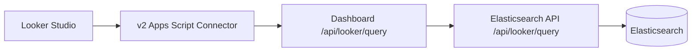

# V3 Events Connector Phased Plan

This document describes how to add event reporting to a new `v3` Looker Studio connector while preserving the current `v2` pageview connector behavior.

## Current State

The active Looker connector flow is:



Relevant implementation points:

- `v2/Code.gs` owns the connector schema, field translation, filter normalization, sorting, row limits, and the `POST /api/looker/query` payload.
- `../dashboard/src/responders/api/looker/query.ts` validates the connector-facing POST body, checks website access, and forwards the normalized request to elasticsearch-api.
- `../elasticsearch-api/server/rest/looker.js` validates the upstream request, builds Elasticsearch aggregations, and shapes rows for Looker.
- The current Looker planner uses the pageview hostname field `hostname_non_robot_pageview` and only has a pageview dataset field catalog.
- The current finalized behavior is documented in `docs/implementation/final-spec.md`.

Events already exist elsewhere in the product stack:

- events are stored as custom datapoints
- event name is stored in `datapoint`
- event rows are identified by `custom_datapoint = true`
- non-robot event queries can use `hostname_non_robot_event`
- event metadata is stored under `metadata_flattened.*`
- dashboard event features already call `/datapoints/stats`, `/datapoints/top`, `/datapoints/metadata`, `/datapoints/histogram`, and `/datapoints/conversion`

The missing piece is a Looker-oriented events contract and planner.

## Product Decision

Build events in `v3`, not by changing the shipped `v2` connector.

Recommended user model:

- `v3` has a required data source config field called `Dataset`.
- Supported values are `Pageviews` and `Events`.
- A Looker data source instance exposes one dataset schema at a time.
- Users who need both pageviews and events in the same report add two Simple Analytics data sources.

Why this is better than one mixed schema:

- Looker schemas are easier to reason about when a data source has one dataset.
- It avoids charts that accidentally combine `path` with `events` or `event_name` with `pageviews`.
- It keeps v2 reports untouched.
- It lets event metadata become dynamic later without destabilizing the pageview schema.

Important rule:

- Do not support mixed pageview and event fields in one query.

## Contract Shape

Keep the same public dashboard endpoint:

- connector to dashboard: `POST /api/looker/query`
- dashboard to elasticsearch-api: `POST /api/looker/query`

Add one logical selector:

```json
{
  "dataset": "events",
  "hostname": "example.com",
  "timezone": "Europe/Amsterdam",
  "dateRange": {
    "start": "2026-01-01",
    "end": "2026-01-31"
  },
  "interval": "day",
  "dimensions": ["date"],
  "metrics": ["events"],
  "filters": [],
  "orderBy": [
    {
      "field": "date",
      "direction": "ASC"
    }
  ],
  "limit": 100
}
```

Rules:

- `dataset` is required for `v3` connector requests.
- Dashboard and elasticsearch-api should default missing `dataset` to `pageviews` so existing `v2` requests remain valid.
- `dataset=pageviews` keeps the current pageview planner behavior.
- `dataset=events` uses an event-specific catalog and event-specific Elasticsearch field mappings.
- `interval` is only valid when the normalized `date` dimension is selected.
- `orderBy` stays limited to one clause.

## V3 Event Field Catalog

Phase 1 should only ship static event reporting fields.

Event dimensions:

- `date_hour`
- `date_day`
- `date_week`
- `date_month`
- `date_year`
- `event_name`

Event metrics:

- `events`
- `unique_visitors`

Connector to API mapping:

| Connector field | API field | Elasticsearch field |
| --- | --- | --- |
| `date_hour` | `date` with `interval=hour` | `@timestamp` date histogram |
| `date_day` | `date` with `interval=day` | `@timestamp` date histogram |
| `date_week` | `date` with `interval=week` | `@timestamp` date histogram |
| `date_month` | `date` with `interval=month` | `@timestamp` date histogram |
| `date_year` | `date` with `interval=year` | `@timestamp` date histogram |
| `event_name` | `event_name` | `datapoint` |
| `events` | `events` | document count on event dataset |
| `unique_visitors` | `unique_visitors` | cardinality on `meta.session_id` |

Do not expose event metadata fields in the first event release.

## Response Shape

Use the same upstream response envelope as v2.

Example event response:

```json
{
  "schema": [
    { "name": "event_name", "type": "STRING" },
    { "name": "events", "type": "NUMBER" }
  ],
  "rows": [
    {
      "event_name": "signup",
      "events": 42
    }
  ],
  "meta": {
    "dataset": "events",
    "queryType": "terms",
    "rowCount": 1,
    "truncated": false
  }
}
```

The connector should continue mapping response rows into the exact Looker requested field order.

## Phase 0 - V3 Foundation

Goal: create the v3 seam without changing v2 behavior.

Connector work:

- Create `v3/Code.gs` from the current `v2/Code.gs`.
- Keep pageview behavior functionally identical at first.
- Add a required `dataset` config select with values `pageviews` and `events`.
- Make `getSchema(request)` return the field catalog for `request.configParams.dataset`.
- Add `dataset` to `buildRequestPayload`.
- Add `dataset` to the connector query fingerprint and logs.
- Treat changing the dataset on an existing Looker data source as a schema-changing action.

Dashboard work:

- Add `dataset` to `PostQuerySchema` with default `pageviews`.
- Split dashboard Looker validation into dataset-specific field catalogs.
- Include `dataset` in access-safe logs and query fingerprints.
- Forward `dataset` to elasticsearch-api unchanged.

Elasticsearch API work:

- Add `dataset` parsing with default `pageviews`.
- Refactor the current Looker constants into dataset-specific catalogs.
- Keep the existing pageview planner schema and row output compatible; only add optional metadata such as `meta.dataset`.
- Include `dataset` in query summary logs.

Done means:

- Existing v2 requests without `dataset` still work.
- v3 pageview data source returns the same rows as v2 for equivalent charts.
- Unknown datasets return `400` from dashboard and elasticsearch-api.

## Phase 1 - Static Event Reporting MVP

Goal: support event scorecards, time series, and top-event tables.

Supported Looker shapes:

- scorecard: `events`
- scorecard: `unique_visitors`
- time series: `date_day + events`
- time series: `date_day + unique_visitors`
- top events table/bar: `event_name + events`
- top events table/bar: `event_name + unique_visitors`

Connector work:

- Add the static event catalog listed above.
- Reuse the existing date field mapping and date validators.
- Default date charts to `orderBy: [{ field: "date", direction: "ASC" }]`.
- Default grouped event charts to sorting by the first selected metric descending.
- Do not enable event filters yet; keep filter rollout separate so the first event release is only aggregation and row shaping.
- Reject pageview-only fields when the configured dataset is `events` by not exposing them in schema.

Dashboard work:

- For `dataset=events`, accept dimensions `date` and `event_name`.
- For `dataset=events`, accept metrics `events` and `unique_visitors`.
- For `dataset=events`, require `filters` to be empty in this phase.
- Preserve the existing row limit behavior: `limit` is optional and, if omitted, grouped queries return all collected rows.

Elasticsearch API work:

- Add an event planner path in `server/rest/looker.js`.
- Use `hostname_non_robot_event` for the base event dataset query.
- Map `event_name` to the `datapoint` terms field.
- Map `events` to `doc_count`.
- Map `unique_visitors` to cardinality on `meta.session_id`.
- Reuse the existing scorecard, date histogram, grouped row, sorting, and response shaping patterns where possible.

Done means:

- Event scorecard works.
- Event unique visitor scorecard works.
- Event time series works for every supported interval.
- Top events table works and sorts by `events DESC` by default.
- Event filter requests are rejected cleanly until Phase 3.
- Pageview v2 and v3 parity tests still pass.

## Phase 2 - Multi-Dimension Event Tables

Goal: allow useful event breakdowns beyond top-event lists.

Supported shapes:

- `date_day + event_name + events`
- `date_month + event_name + unique_visitors`
- `event_name + events + unique_visitors`

Connector work:

- Reuse the current composite query behavior for event dataset charts with more than one dimension.
- Keep max dimensions and max metrics aligned with the finalized connector spec unless performance data says otherwise.
- Keep the default grouped sort by first selected metric descending.

Dashboard work:

- Validate event composite requests with the same generic rules as pageviews.
- Ensure selected sort fields belong to the selected event dimensions or selected event metrics.

Elasticsearch API work:

- Reuse composite aggregation pagination for event dimensions.
- Support composite sources for `date` and `event_name`.
- Keep `missing_bucket` behavior consistent with pageview grouped rows.

Done means:

- Looker tables can show event counts by date and event name.
- Unlimited grouped collection behavior remains bounded by composite page size internally.
- Sorting and `limit` work the same way as pageview grouped queries.

## Phase 3 - Event Filter Controls

Goal: make event reports usable with Looker controls.

Supported filters:

- `event_name EQUALS value`
- `event_name IN values`
- `event_name NOT_EQUALS value`

Optional later:

- `event_name CONTAINS value`, only if product wants text search behavior and we accept wildcard cost.

Connector work:

- Add `event_name` to event dataset `FIELD_FILTER_RULES`.
- Keep filter field alias resolution working for `Event Name` labels.
- Include dataset in skipped-filter and unsupported-filter logs.

Dashboard work:

- Keep the same filter validation rules as elasticsearch-api.
- Return clear `400` errors for unsupported event filter fields or operators.

Elasticsearch API work:

- Map `event_name` filters to `datapoint` term or terms queries.
- Map `NOT_EQUALS` to `must_not` on `datapoint`.

Done means:

- Looker filter controls can narrow event reports to one or more event names.
- Invalid event filter requests fail before querying Elasticsearch.

## Phase 4 - Guarded Event Metadata Dimensions

Goal: expose site-specific event metadata without making Looker schemas unstable or expensive.

Do this after static event reporting is stable.

Recommended model:

- Add a dashboard-owned Looker schema helper, for example `GET /api/looker/schema?hostname=example.com&dataset=events`.
- The connector calls that helper from `getSchema(request)` when `dataset=events` and an API key is configured.
- The dashboard validates access, calls existing metadata discovery, and returns safe Looker field definitions.
- The schema helper uses `../elasticsearch-api` metadata data from `/api/datapoints/metadata` or a small new POST endpoint if GET query limits become awkward.

Metadata field id strategy:

- Prefix event metadata dimensions with `event_meta_`.
- Generate deterministic ASCII field ids from the raw metadata key.
- Keep a reversible mapping server-side or encode enough information in the field id to map back to `metadata_flattened.*`.
- Keep labels user-friendly, for example `Event Meta: plan`.

Guardrails:

- Expose only allowlisted metadata keys at first.
- Cap the number of metadata dimensions returned per data source.
- Hide or block high-cardinality keys by default.
- Do not expose session IDs, visitor IDs, raw URLs, or other fields that behave like identifiers.
- Cache metadata schema responses briefly in the connector or dashboard.

Connector work:

- Merge static event fields with approved dynamic metadata fields.
- Add metadata fields as dimensions only.
- Add filter support only for approved metadata fields after grouping works.

Dashboard work:

- Validate metadata field ids against the same allowlist used by schema generation.
- Map connector metadata ids to Elasticsearch fields under `metadata_flattened.*`.
- Normalize URL parameter keys using the existing `sa_p_` / `sa_urlparam_` convention.

Elasticsearch API work:

- Add event metadata dimensions to the Looker event dimension catalog.
- Support metadata terms sources in grouped and composite event queries.
- Keep responses flat with connector-facing field ids, not raw Elasticsearch field names.

Done means:

- A site can group event reports by one approved metadata key.
- Unknown metadata field ids return `400`.
- Metadata schema stays stable enough for saved Looker charts.

## Phase 5 - Metadata Filters

Goal: allow Looker controls to filter by approved event metadata.

Supported operators first:

- `EQUALS`
- `IN`
- `NOT_EQUALS`

Connector work:

- Add approved metadata fields to event filter rules.
- Do not enable `CONTAINS` by default.

Dashboard work:

- Reject metadata filters for fields not present in the approved schema.
- Keep filter summaries sanitized in logs.

Elasticsearch API work:

- Map metadata filters to `metadata_flattened.*` term or terms queries.
- Use `must_not` for `NOT_EQUALS`.

Done means:

- Looker controls can filter event tables by approved metadata.
- Invalid metadata filters fail with a useful `400` response.

## Phase 6 - Hardening And Release

Goal: ship v3 without regressing v2.

Testing:

- Add connector manual tests for `v3` pageviews and events.
- Add dashboard request validation tests for pageview and event datasets.
- Add elasticsearch-api tests for event scorecard, date histogram, terms, composite, filters, sort, and limit.
- Add regression tests proving v2 requests without `dataset` still work.

Observability:

- Include `dataset` in connector logs, dashboard logs, elasticsearch-api logs, and query fingerprints.
- Track row count, query type, dimension count, metric count, filter count, sort count, duration, and truncation.
- Watch event composite queries for bucket explosion before enabling broad metadata exposure.

Documentation:

- Update `docs/implementation/final-spec.md` after the v3 contract is implemented.
- Add v3 manual test instructions alongside the existing phase test docs.
- Mark the old events implementation plan as historical or replace it with a link to this v3 plan.

Release plan:

- Deploy dashboard and elasticsearch-api first with optional `dataset` defaulting to `pageviews`.
- Deploy `v3/Code.gs` after both servers accept event dataset requests.
- Keep `v2/Code.gs` published for existing data sources.
- Publish v3 as a new connector version or deployment so users opt into the new schema.

Done means:

- v3 pageview source works.
- v3 event source works.
- v2 source still works.
- Event MVP documentation and manual tests are complete.

## Deferred Scope

Do not include these in the first event rollout:

- mixed pageview and event charts in one data source
- funnels or ordered conversion chains
- unrestricted dynamic metadata exposure
- arbitrary Elasticsearch field access
- raw event export through the Looker connector

Funnels should remain a separate analytical mode. Existing product behavior uses `/datapoints/conversion`, which has different semantics from a normal grouped reporting query.

## Suggested Build Order

1. Add optional `dataset` support to dashboard and elasticsearch-api with pageview default.
2. Create `v3/Code.gs` and prove pageview parity.
3. Add the static event catalog and event planner.
4. Ship event scorecards, time series, and top events.
5. Add event composite tables.
6. Add `event_name` filters.
7. Add guarded metadata dimensions.
8. Add metadata filters.
9. Revisit funnels only if Looker users need funnel reporting.

## Open Questions

- Should the v3 connector default to `pageviews` or force users to choose a dataset explicitly?
- Should event metadata allowlists be configured per team, per website, or globally?
- Do event reports need `include_robots` as a connector config, or should Looker keep the current non-robot default only?
- Do we want `unique_visitors` for events in the first public release, or should the first event metric be only `events`?
