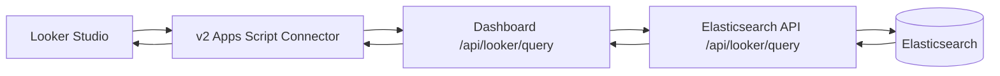

# Full Implementation Plan

This document describes the full implementation path for the `v2` Looker Studio connector.

It is organized by phase on purpose. Each phase explains:

- what the phase adds
- what changes in the connector, dashboard, and elasticsearch-api
- what stays out of scope until later
- what “done” means
- which dedicated phase test doc to use

## Scope And Constraints

- `v2/Code.gs` is the only active connector code.
- `v1` stays untouched.
- The connector calls the dashboard proxy at `https://simpleanalytics.com/api/looker/query`.
- The dashboard validates access and forwards supported requests to `../elasticsearch-api`.
- `../elasticsearch-api` owns query planning, Elasticsearch DSL generation, and response shaping.
- Caching is out of scope for now.

## End Goal

Ship a production-ready Looker Studio connector that supports:

- scorecards
- time series charts
- interval-aware date histograms for `hour`, `day`, `week`, `month`, and `year`
- breakdown charts
- tables
- date range controls
- filter controls
- chart-level filters
- sorting
- row limits
- a safe, curated field list of dimensions and metrics

## Global Defaults

These decisions apply across all phases unless explicitly changed later.

- canonical timestamp field: reuse the same field already used by the existing histogram flow
- unique visitor key: reuse the existing stable visitor or session identifier used in product analytics
- `unique_pageviews`: do not expose it in the first full implementation
- hard limits: `3` dimensions, `5` metrics, `1000` rows
- supported date intervals: `hour`, `day`, `week`, `month`, `year`
- default interval: `day`
- `CONTAINS` allowlist:
  - `path`
  - `referrer_hostname`
  - `utm_source`
  - `utm_medium`
  - `utm_campaign`
- referrer exposure: only `referrer_hostname` initially

## Shared Architecture



## Phase 1 — Stable POST Contract

Use this with `docs/implementation/phase-1-tests.md`.

### Goal

Replace the POC-style query flow with the real POST contract and make the connector usable for the first core Looker shapes.

### What Phase 1 Includes

- scorecards
- date histograms
- top paths
- interval-aware date histograms
- one stable `POST /api/looker/query` contract across dashboard and elasticsearch-api

### Supported Looker Use Cases In Phase 1

- scorecard: `pageviews`
- time series: `date_day + pageviews`
- time series: `date_week + pageviews`
- time series: `date_month + pageviews`
- time series: `date_year + pageviews`
- time series: `date_hour + pageviews` for short ranges
- top paths table or bar chart: `path + pageviews`

### Contract In Phase 1

Dashboard endpoint:

- `POST /api/looker/query`

Elasticsearch API endpoint:

- `POST /api/looker/query`

Phase-1 request shape:

```json
{
  "hostname": "example.com",
  "timezone": "Europe/Amsterdam",
  "dateRange": {
    "start": "2026-01-01",
    "end": "2026-01-31"
  },
  "interval": "month",
  "dimensions": ["date"],
  "metrics": ["pageviews"],
  "filters": [],
  "orderBy": [
    {
      "field": "date",
      "direction": "ASC"
    }
  ],
  "limit": 100
}
```

Phase-1 rules:

- `interval` is only valid when `dimensions` contains `date`
- if `interval` is omitted on a date request, default it to `day`
- only one dimension is supported
- only one metric is supported
- that one metric is `pageviews`
- `filters` must be empty in phase 1

### Connector Work In Phase 1

The connector becomes a translator, not a data processor.

#### Schema

Expose these fields:

- `date_hour`
- `date_day`
- `date_week`
- `date_month`
- `date_year`
- `path`
- `pageviews`

#### Date field mapping

The connector should distinguish user-facing date dimensions from the normalized API contract.

- `date_hour` -> `dimensions: ["date"]`, `interval: "hour"`, semantic type `YEAR_MONTH_DAY_HOUR`
- `date_day` -> `dimensions: ["date"]`, `interval: "day"`, semantic type `YEAR_MONTH_DAY`
- `date_week` -> `dimensions: ["date"]`, `interval: "week"`, semantic type `YEAR_WEEK`
- `date_month` -> `dimensions: ["date"]`, `interval: "month"`, semantic type `YEAR_MONTH`
- `date_year` -> `dimensions: ["date"]`, `interval: "year"`, semantic type `YEAR`

#### Translation behavior

The connector should extract from `getData(request)`:

- selected fields
- date range
- config params (`hostname`, `apiKey`, `timezone`)
- sort request
- row limit

The connector should then build one normalized POST payload for the dashboard.

#### Response handling

The connector should only:

- validate row shapes
- validate date formats per interval
- map rows to requested field order

It should not:

- perform aggregation
- expand buckets itself
- implement filters locally

### Dashboard Work In Phase 1

The dashboard becomes the strict public contract boundary.

#### Validation

Validate:

- hostname
- timezone
- dateRange
- interval
- dimensions
- metrics
- orderBy
- limit

Reject:

- invalid timezone
- invalid interval
- non-date requests that include `interval`
- metrics other than `pageviews`
- more than one dimension
- non-empty filters

#### Access control

- keep `Api-Key` as the connector auth mechanism
- validate that the API key can access the hostname

#### Normalization

- default date interval to `day`
- forward only the supported POST payload upstream

### Elasticsearch API Work In Phase 1

The elasticsearch-api implements the first real query planner.

#### Supported query types

- `scorecard`: no dimensions
- `date_histogram`: one `date` dimension
- `terms`: one `path` dimension

#### Date intervals

Support:

- `hour`
- `day`
- `week`
- `month`
- `year`

Format output dates as:

- hour -> `YYYYMMDDHH`
- day -> `YYYYMMDD`
- week -> `YYYYWW`
- month -> `YYYYMM`
- year -> `YYYY`

#### Sorting rules

- scorecard: no sorting
- date histogram: only sort by `date`
- terms: only sort by `pageviews DESC`

### Out Of Scope In Phase 1

- filters
- metrics other than `pageviews`
- multi-dimension tables
- composite aggregations

### Phase 1 Done Means

- POST-only flow works end-to-end
- scorecard works
- top paths works
- all five date intervals work
- omitted date interval defaults to `day`
- dashboard and elasticsearch-api return the same payload shape

## Phase 2 — Expand The Field Surface

Use this with `docs/implementation/phase-2-tests.md`.

### Goal

Expand from the phase-1 POC field set to the first real self-serve set of dimensions and metrics.

### What Phase 2 Includes

- more dimensions
- more metrics
- correct Looker schema semantics for those fields
- still no filters yet
- still no multi-dimension grouped tables yet

### Field Catalog Model In Phase 2

The connector, dashboard, and elasticsearch-api should use the same logical field catalog, even if each repo stores it differently.

Each field definition should include:

- connector field id
- label
- Looker concept type
- Looker semantic type
- normalized API field id
- Elasticsearch field name or aggregation definition
- allowed sort behavior
- allowed filter operators
- serializer for Looker output
- whether it is safe for grouping
- whether it is high-cardinality and should stay hidden or guarded

### Initial Production-Oriented Dimensions

- `date_hour`
- `date_day`
- `date_week`
- `date_month`
- `date_year`
- `path`
- `referrer_hostname`
- `country_code`
- `device_type`
- `browser_name`
- `os_name`
- `utm_source`
- `utm_medium`
- `utm_campaign`

### Initial Production-Oriented Metrics

- `pageviews`
- `unique_visitors`
- `avg_duration`
- `avg_scroll`

Do not expose:

- `unique_pageviews`
- raw referrer URL
- full user agent
- UUID-like identifiers
- uncontrolled high-cardinality fields

### Connector Work In Phase 2

- generate schema from the catalog, not one-off logic
- expose dimensions as dimensions and metrics as metrics
- keep interval-specific date fields in the connector-facing schema
- keep translating date fields into normalized `date + interval`

### Dashboard Work In Phase 2

- validate all field ids against an allowlist
- validate metric and dimension combinations against the catalog
- reject unknown dimensions or metrics with `400`

### Elasticsearch API Work In Phase 2

Add aggregation builders for:

- `pageviews`: count / doc_count semantics
- `unique_visitors`: cardinality on the chosen stable visitor/session identifier
- `avg_duration`: avg aggregation
- `avg_scroll`: avg aggregation

### Out Of Scope In Phase 2

- filters
- multi-dimension grouped tables
- composite aggregations

### Phase 2 Done Means

- users can build at least five common charts without connector changes
- new dimensions appear correctly as dimensions in Looker
- new metrics appear correctly as metrics in Looker
- interval-specific date fields still serialize correctly

## Phase 3 — Filters Pushdown

Use this with `docs/implementation/phase-3-tests.md`.

### Goal

Push Looker filter controls and chart filters all the way down into Elasticsearch.

### What Phase 3 Includes

- parsing `dimensionsFilters`
- normalizing filters in the connector
- validating filters in the dashboard
- translating filters into Elasticsearch `bool.filter`

### Supported Filter Operators In Phase 3

Start with:

- `EQUALS`
- `IN`
- `CONTAINS`
- `NOT_EQUALS`

### Connector Work In Phase 3

- inspect real `dimensionsFilters` payloads from Looker first
- normalize filter values into arrays
- forward a stable `filters` array in the POST contract

### Dashboard Work In Phase 3

- validate filter fields against the field catalog
- validate filter operators against the field allowlist
- reject unsupported filters with `400`

### Elasticsearch API Work In Phase 3

Translate filters into Elasticsearch clauses.

#### Exact operators

- `EQUALS` -> `term`
- `IN` -> `terms`
- `NOT_EQUALS` -> `must_not term`

#### Text contains operator

Allow `CONTAINS` only for:

- `path`
- `referrer_hostname`
- `utm_source`
- `utm_medium`
- `utm_campaign`

Prefer bounded wildcard or query-string handling only where tested and safe.

### Filter Rules

- all filters must be allowlisted
- unknown operators fail fast
- connector logs filter summaries, not raw sensitive values
- date controls and filter controls must both apply server-side

### Out Of Scope In Phase 3

- regex filters
- arbitrary calculated-field pushdown
- every possible Looker filter form before seeing real payloads

### Phase 3 Done Means

- filter controls change results server-side
- chart-level filters change results server-side
- invalid operators fail with `400`
- logs make it clear which filters were applied

## Phase 4 — Multi-Dimension Tables

Use this with `docs/implementation/phase-4-tests.md`.

### Goal

Support grouped tables and grouped breakdowns with two or more dimensions.

### What Phase 4 Includes

- two-dimension grouped results first
- three-dimension grouped results if performance stays acceptable
- composite aggregations in Elasticsearch
- flat row shaping back to Looker

### Typical Phase-4 Queries

- `date_month + country_code + pageviews`
- `path + device_type + unique_visitors`
- `country_code + browser_name + avg_duration`

### Connector Work In Phase 4

- allow more than one selected dimension
- preserve requested field order when flattening rows back to Looker
- keep date dimensions normalized to `date + interval`

### Dashboard Work In Phase 4

- validate max dimensions
- validate grouped sort and limit requests
- continue blocking unsupported high-cardinality combinations

### Elasticsearch API Work In Phase 4

#### Query planner

Add `composite` planning for requests with two or more dimensions.

#### Output shaping

- flatten composite buckets into one row per bucket
- keep output keyed by logical field ids
- keep row shapes flat, never nested

### Guardrails

- no more than `3` dimensions
- no high-cardinality dimensions in grouped mode initially
- fail loudly instead of silently degrading unsupported combinations

### Phase 4 Done Means

- Looker tables with two dimensions and one metric work without connector special-casing
- grouped date tables work with interval-aware date fields
- responses remain flat and stable

## Phase 5 — Guardrails And Production Hardening

Use this with `docs/implementation/phase-5-tests.md`.

### Goal

Make the connector safe to roll out and easy to debug when something goes wrong.

### What Phase 5 Includes

- finalized limits
- final error behavior
- observability
- replayable tests
- hardened rejection paths for bad requests

### Dashboard Work In Phase 5

- preserve upstream `400`, `403`, `404`, and similar errors where possible
- always return a clean `{ error }` payload to the connector
- log query summaries, not secrets

### Elasticsearch API Work In Phase 5

#### Guardrails

- max dimensions: `3`
- max metrics: `5`
- max rows: `1000`
- max response size
- reject unsupported combinations instead of silently approximating them

#### Response shape

Return flat rows plus metadata:

```json
{
  "schema": [
    { "name": "date", "type": "STRING" },
    { "name": "country_code", "type": "STRING" },
    { "name": "pageviews", "type": "NUMBER" }
  ],
  "rows": [
    {
      "date": "202601",
      "country_code": "NL",
      "pageviews": 123
    }
  ],
  "meta": {
    "queryType": "composite",
    "rowCount": 1,
    "truncated": false
  }
}
```

#### Observability

Log:

- query shape
- dimension count
- metric count
- filter count
- sort count
- limit
- row count
- request duration
- upstream duration if available
- normalized query fingerprint for replay testing

### End-To-End Looker Checks In Phase 5

The production connector should support these report-building cases:

- scorecard: `pageviews`
- scorecard: `unique_visitors`
- time series: `date_day + pageviews`
- time series: `date_week + pageviews`
- time series: `date_month + pageviews`
- time series: `date_year + pageviews`
- time series: `date_hour + pageviews` for reasonable short ranges
- bar chart: `country_code + pageviews`
- bar chart: `device_type + unique_visitors`
- table: `path + pageviews`
- table: `date_day + country_code + pageviews`
- report date control
- drop-down filter controls
- text contains filter on path

### Phase 5 Done Means

- invalid, oversized, and unauthorized requests fail cleanly
- standard report requests still succeed after hardening work
- failures are diagnosable from logs and replay fixtures

## Phase Test Docs

- `docs/implementation/phase-1-tests.md`
- `docs/implementation/phase-2-tests.md`
- `docs/implementation/phase-3-tests.md`
- `docs/implementation/phase-4-tests.md`
- `docs/implementation/phase-5-tests.md`

## Recommended Build Order

1. Finish phase 1 and make the POST contract stable.
2. Expand the field catalog in phase 2.
3. Add filter pushdown in phase 3.
4. Add multi-dimension grouped tables in phase 4.
5. Finalize guardrails and production hardening in phase 5.
