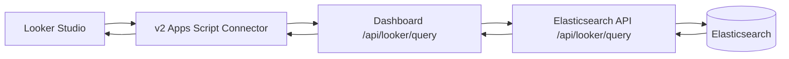

# Full Implementation Plan

This document describes the full implementation path for the `v2` Looker Studio connector after the POC cleanup. It reflects the real production flow:

- `v2/Code.gs` is the only active connector code.
- The connector calls the dashboard proxy at `https://simpleanalytics.com/api/looker/query`.
- The dashboard proxy validates access and forwards supported requests to `../elasticsearch-api`.
- `../elasticsearch-api` owns query planning, Elasticsearch DSL generation, and response shaping.
- Caching is intentionally out of scope for now.

## Goal

Ship a production-ready Looker Studio connector that supports the main self-serve reporting workflows people expect:

- scorecards
- time series charts
- breakdown charts
- tables
- date range controls
- filter controls
- chart-level filters
- sorting
- row limits
- a safe, curated field list of dimensions and metrics

## Non-Goals

- No work in `v1`
- No raw-row export path in `v2`
- No caching layer for now
- No attempt to support every possible Looker Studio request shape on day one
- No high-cardinality or unbounded group-bys without explicit guardrails

## Architecture



## What The Full Connector Must Extract From Looker Studio

The connector should normalize the useful parts of `getData(request)` into a stable internal request contract.

### Required request inputs

- `fields`: selected dimensions and metrics
- `dateRange`: start and end dates
- `configParams`: hostname, API key, timezone
- `dimensionsFilters`: filter controls and chart filters
- `orderBys`: requested sorting
- `rowLimit`: requested row limit

### Supported Looker behaviors

- zero dimensions + one or more metrics for scorecards
- one dimension + one or more metrics for common charts
- two or more dimensions for tables and grouped breakdowns
- date dimension as a special histogram dimension
- filter controls applied server-side
- chart-level sort and row limits applied server-side

### Explicitly deferred until needed

- connector-driven pagination
- drill actions / drill path support
- arbitrary calculated fields generated in Looker and pushed down to Elasticsearch
- regex-heavy filtering on unbounded fields

## Target Contract

We should move from the current query-string POC route to a POST contract.

We do not need backwards compatibility for `v2` at this stage. It is fine to replace the POC request shape directly as we move to the real contract.

### Dashboard endpoint

- `POST /api/looker/query`

### Elasticsearch API endpoint

- `POST /api/looker/query`

### Request shape

```json
{
  "hostname": "example.com",
  "timezone": "Europe/Amsterdam",
  "dateRange": {
    "start": "2026-01-01",
    "end": "2026-01-31"
  },
  "dimensions": ["date", "country_code"],
  "metrics": ["pageviews", "unique_visitors"],
  "filters": [
    {
      "field": "device_type",
      "operator": "IN",
      "values": ["desktop", "mobile"]
    }
  ],
  "orderBy": [
    {
      "field": "pageviews",
      "direction": "DESC"
    }
  ],
  "limit": 500
}
```

### Response shape

```json
{
  "schema": [
    { "name": "date", "type": "STRING" },
    { "name": "country_code", "type": "STRING" },
    { "name": "pageviews", "type": "NUMBER" },
    { "name": "unique_visitors", "type": "NUMBER" }
  ],
  "rows": [
    {
      "date": "20260101",
      "country_code": "NL",
      "pageviews": 123,
      "unique_visitors": 98
    }
  ],
  "meta": {
    "queryType": "composite",
    "rowCount": 1,
    "truncated": false
  }
}
```

## Field Catalog

The connector, dashboard proxy, and elasticsearch-api should all use the same logical field catalog, even if each repo keeps its own representation.

Each field entry should define:

- connector field id
- label
- Looker concept type (`DIMENSION` or `METRIC`)
- Looker semantic type
- upstream request id
- Elasticsearch field name or aggregation definition
- allowed filter operators
- allowed sort behavior
- serializer for Looker output
- whether the field is safe for grouping
- whether the field is high-cardinality and should stay hidden or guarded

### Initial dimension set

- `date`
- `path`
- `referrer_hostname`
- `country_code`
- `device_type`
- `browser_name`
- `os_name`
- `utm_source`
- `utm_medium`
- `utm_campaign`

### Initial metric set

- `pageviews`
- `unique_visitors`
- `avg_duration`
- `avg_scroll`

`unique_pageviews` is intentionally not exposed in the first full implementation.

### Fields to avoid exposing initially

- raw referrer URL
- full user agent
- UUID-like identifiers
- any field with uncontrolled cardinality

## Connector Work (`v2/Code.gs`)

### 1. Schema generation

- Replace the POC-only field handling with a catalog-driven schema builder.
- Expose dimensions and metrics from the catalog rather than hardcoded shape checks.
- Ensure date is emitted as `YEAR_MONTH_DAY`.

### 2. Request translation

- Add a request translator that reads the Looker `getData(request)` object.
- Split selected fields into `dimensions[]` and `metrics[]`.
- Normalize `dateRange`, `rowLimit`, `orderBys`, and `dimensionsFilters`.
- Produce one stable POST payload for the dashboard proxy.

### 3. Filter extraction

- Log and inspect real `dimensionsFilters` requests first.
- Translate only the filter forms Looker actually sends in practice.
- Start with:
  - `EQUALS`
  - `IN`
  - `CONTAINS`
  - `NOT_EQUALS`
- Normalize multi-value filters into arrays.

### 4. Error handling

- Keep user-facing errors short and actionable.
- Detect malformed upstream responses.
- Detect unsupported field combinations early in Apps Script.
- Include sanitized debug logs for query shape, filter count, and row count.

### 5. Connector behavior rules

- Hardcode the dashboard endpoint.
- Keep `hostname`, `apiKey`, and `timezone` as connector config.
- Do not do aggregation or expensive transformations in Apps Script.
- Only do field validation, translation, and row mapping.

## Dashboard Proxy Work (`../dashboard`)

### 1. Public contract and validation

- Move from POC query params to a POST body.
- Validate the full payload with Zod.
- Validate timezone values.
- Validate dimensions, metrics, filters, order clauses, and limits against an allowlist.

### 2. Authentication and tenancy

- Keep `Api-Key` as the connector auth mechanism.
- Validate the hostname against the API key using the existing dashboard access path.
- Reject any payload where hostname access is not allowed.

### 3. Request normalization

- Normalize missing defaults before proxying upstream.
- Enforce max dimensions, max metrics, and max row limit at the dashboard layer.
- Remove unsupported or dangerous fields before forwarding.

### 4. Error mapping

- Preserve upstream `400`, `403`, `404`, and `422` style errors where possible.
- Return a clean `{ error }` payload to the connector.
- Log validation failures and upstream failures with query summaries, not secrets.

### 5. Observability

- Log query shape, dimension count, metric count, filter count, sort count, limit, and row count.
- Add request duration and upstream duration if available.
- Include a normalized query fingerprint for replay testing.

## Elasticsearch API Work (`../elasticsearch-api`)

### 1. Query planner

Build a real planner behind `/api/looker/query` that selects one of these strategies:

- `scorecard`: no dimensions
- `date_histogram`: dimension is `date`
- `terms`: one non-date dimension
- `composite`: two or more dimensions

### 2. Aggregation builders

- `pageviews`: count / doc_count semantics
- `unique_visitors`: cardinality on the existing stable visitor or session identifier already used in product analytics
- `avg_duration`: avg aggregation
- `avg_scroll`: avg aggregation

Do not expose `unique_pageviews` in the first full implementation.

### 3. Filter translation

Translate normalized filters into Elasticsearch `bool.filter` clauses.

#### Exact filters

- `EQUALS` -> `term`
- `IN` -> `terms`
- `NOT_EQUALS` -> `must_not term`

#### Text contains filters

- `CONTAINS` only on a small allowlist:
  - `path`
  - `referrer_hostname`
  - `utm_source`
  - `utm_medium`
  - `utm_campaign`
- Prefer safe wildcard or query-string handling only where bounded and tested.

### 4. Sorting

- Support sort by metric desc/asc for terms/composite outputs.
- Support date ascending by default for histograms.
- Reject unsupported sort combinations with a `400`.

### 5. Limits and guardrails

- hard max dimensions: `3`
- hard max metrics per request: `5`
- hard max row limit: `1000`
- hard max response size
- reject unsupported field combinations instead of silently degrading

### 6. Response shaping

- Always return flat rows keyed by logical field ids.
- Keep field order stable.
- Return `meta.truncated` when a guardrail limits output.

### 7. Query correctness concerns

- apply timezone consistently to histogram boundaries
- reuse the same canonical event timestamp field already used by the existing histogram flow
- reuse the existing stable visitor or session identifier already used for product analytics cardinality
- confirm keyword-backed fields for all exposed dimensions

## Filter Support Plan

Filter support is the most important part of the move from POC to a real connector.

### Phase 1 filters

- `country_code = NL`
- `device_type IN [desktop, mobile]`
- `path CONTAINS /blog`
- `utm_source = google`

### Phase 2 filters

- negative filters where Looker sends them predictably
- multi-filter conjunctions on the same chart
- combinations of date controls + filter controls + chart filters

### Filter rules

- all filters must be field-allowlisted
- `CONTAINS` is allowed only on:
  - `path`
  - `referrer_hostname`
  - `utm_source`
  - `utm_medium`
  - `utm_campaign`
- string contains operators stay restricted to known safe text fields
- unknown operators fail fast with `400`
- connector logs the filter summary, not full potentially sensitive values

## Multi-Dimension Tables

Tables are where the implementation stops being “chart-specific” and becomes truly self-serve.

### Requirements

- support two dimensions first
- expand to three dimensions only if performance remains acceptable
- use composite aggregations for stable bucket pagination and predictable output
- flatten composite buckets into one row per bucket

### Example supported requests

- `date + country_code + pageviews`
- `path + device_type + unique_visitors`
- `country_code + browser_name + avg_duration`

### Guardrails

- no more than three dimensions
- no high-cardinality dimensions in multi-dimension mode initially
- fail loudly on unsupported combinations

## Looker Studio Capabilities Checklist

The production connector should explicitly support these report-building cases:

- scorecard: `pageviews`
- scorecard: `unique_visitors`
- time series: `date + pageviews`
- bar chart: `country_code + pageviews`
- bar chart: `device_type + unique_visitors`
- table: `path + pageviews`
- table: `date + country_code + pageviews`
- table sorted by metric descending
- report date control
- drop-down filter controls
- text contains filter on path

## Chosen Defaults

- reuse the existing canonical event timestamp field from the current histogram flow
- reuse the existing stable visitor or session identifier used in product analytics for `unique_visitors`
- do not expose `unique_pageviews` in the first full implementation
- hard limits are `3` dimensions, `5` metrics, and `1000` rows
- `CONTAINS` is allowed only for `path`, `referrer_hostname`, `utm_source`, `utm_medium`, and `utm_campaign`
- expose only `referrer_hostname` initially, not additional referrer fields

## Implementation Phases

Each phase has its own test document with curl examples and a clear definition of done:

- `docs/implementation/phase-1-tests.md`
- `docs/implementation/phase-2-tests.md`
- `docs/implementation/phase-3-tests.md`
- `docs/implementation/phase-4-tests.md`
- `docs/implementation/phase-5-tests.md`

### Phase 1 — Replace the POC contract with the real request model

- introduce the shared field catalog
- move connector and proxy to a stable request translator
- move dashboard and elasticsearch-api to a POST contract
- keep support limited to scorecard, date histogram, and single terms aggregation

**Exit criteria**

- POC charts still work through the new contract
- scorecards work
- a new metric can be added catalog-first instead of endpoint-first

### Phase 2 — Expand the field surface

- add the curated dimensions and metrics list
- verify mappings and aggregations for each field
- ensure Looker shows metrics as metrics and dates as dates

**Exit criteria**

- users can build at least five common charts without connector changes

### Phase 3 — Filters pushdown

- parse and normalize `dimensionsFilters`
- implement phase-1 filter operators end-to-end
- add tests for chart controls and chart-level filters

**Exit criteria**

- filters are confirmed server-side by logs and by response differences

### Phase 4 — Multi-dimension support

- add composite aggregation planning
- add row flattening for 2+ dimensions
- add sort and limit handling for grouped tables

**Exit criteria**

- multi-dimension tables load reliably on typical date ranges

### Phase 5 — Guardrails and production hardening

- finalize limits
- finalize error handling
- finalize monitoring and replay fixtures
- add regression coverage across common query shapes

**Exit criteria**

- rollout risk is low and failures are diagnosable

## Testing Strategy

### Connector tests

- validate request translation from representative Looker requests
- validate schema output for dimensions and metrics
- validate row serialization for dates, strings, and numbers

### Dashboard proxy tests

- invalid API key
- unauthorized hostname
- invalid timezone
- invalid field id
- invalid operator
- unsupported sort
- upstream error passthrough

### Elasticsearch API tests

- scorecard fixture
- timeseries fixture
- top-N fixture
- filtered fixture
- multi-dimension fixture
- invalid request fixture

### End-to-end Looker tests

- create an internal connector test report
- include a date range control
- include dropdown filters
- include a text filter on path
- include scorecard, time series, breakdown chart, and table
- confirm expected refresh behavior and response times

## Recommended Build Order

1. Convert the POC route to the real POST request contract.
2. Finish the shared field catalog across connector, dashboard, and elasticsearch-api.
3. Add scorecards and the first expanded dimension set.
4. Add filter pushdown for `EQUALS`, `IN`, and `CONTAINS`.
5. Add multi-dimension tables with composite aggregations.
6. Finalize limits, monitoring, and regression coverage.
